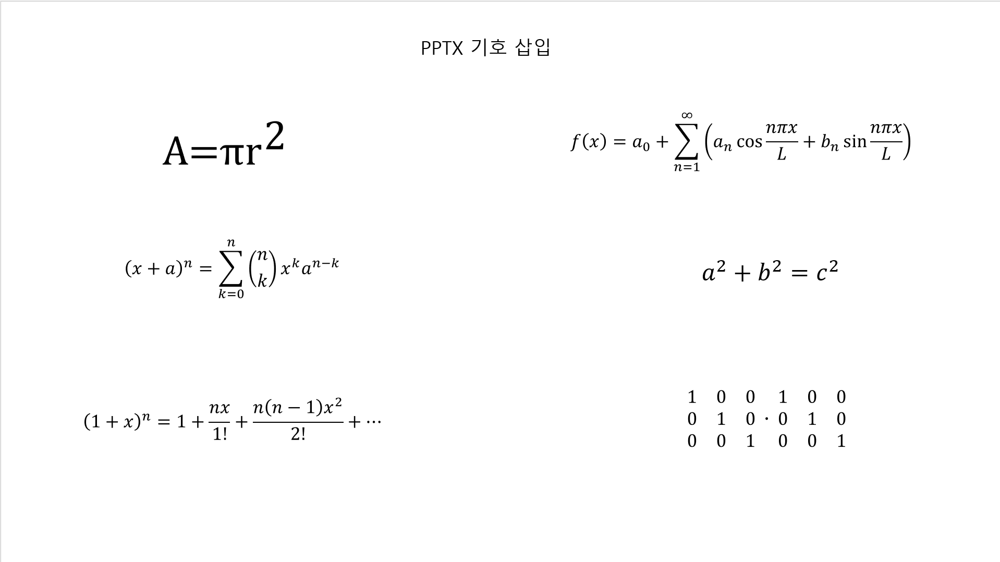
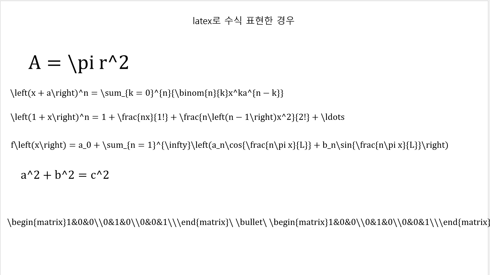
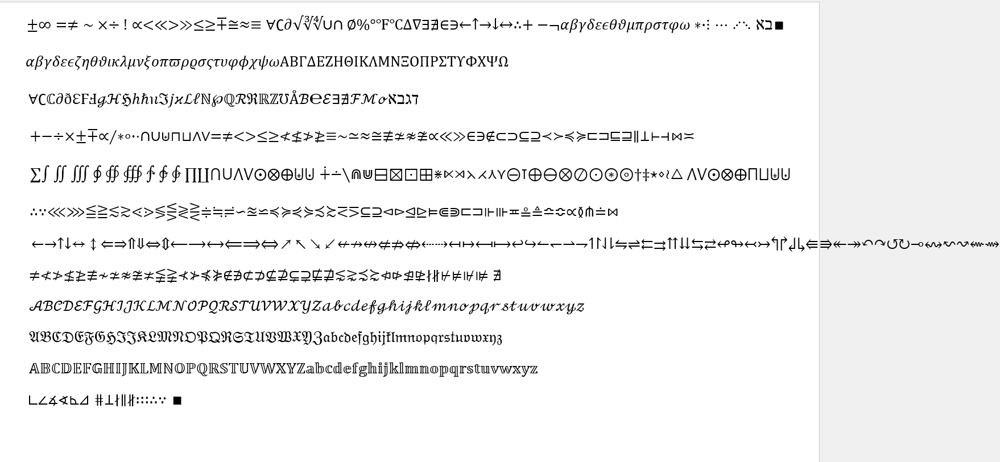
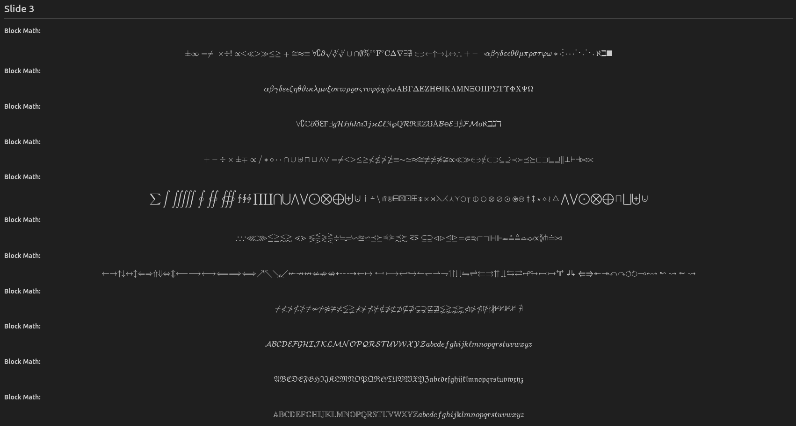
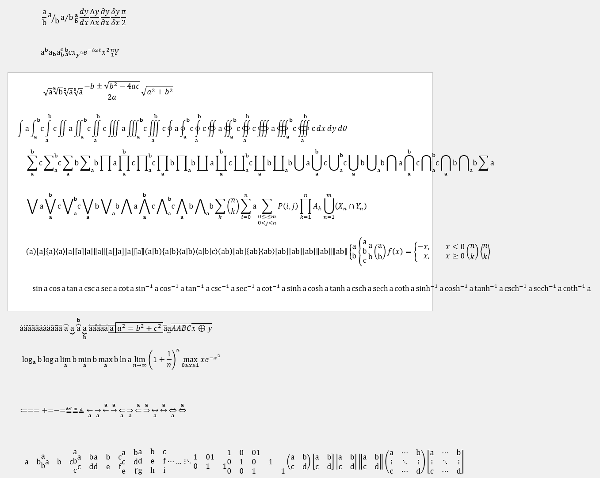
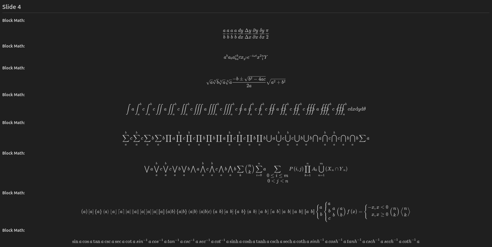
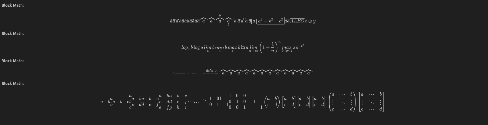

# OMML2LaTeX

OMML (Office Math Markup Language) 수식을 KaTeX 호환 LaTeX 코드로 변환해주는 파이썬 기반 변환기입니다.

## 개요

이 프로젝트는 MS Office의 수식 형식인 OMML을 널리 쓰이는 표준 LaTeX 형식으로 변환하기 위해 작성되었습니다.

ECMA-376 문서를 참고하여 OMML의 구조를 파악하였으며, 프로젝트 내부의 `shared-math-strict.rnc`, `shared-math-strict.xsd`, `shared-math-transitional.xsd` 등 스키마 정의 파일을 기반으로 OMML 요소들을 처리합니다.

각 OMML 노드를 순회하며 구문을 분석하는 방식은 **Recursive Descent Parser**의 형태를 띠도록 코드를 작성하였습니다.

## 주요 특징

- **ECMA-376 표준 기반**: 공식 스키마와 문서를 참조하여 견고한 변환 규칙 적용
- **재귀적 하향 파서 구조**: OMML의 계층적 트리 구조(`oMath`, `f`(분수), `r`(런), `t`(텍스트) 등)를 재귀적으로 순회하여 LaTeX 문자열로 조합
- **유니코드 심볼 매핑 지원**: 수학 알파벳(Math Italics, Script, Fraktur 등) 및 방대한 양의 특수 수학 기호(예: `α` -> `\alpha`)를 적절한 LaTeX 매크로로 식별 및 자동 치환

## 설치

```bash
pip install omml2latex
```

## 파일 구조

- `omml2latex/`: import 가능한 패키지 본체
- `omml2latex/__init__.py`: 공개 API (`convert_omml`)
- `omml2latex/_parser.py`: OMML 파싱 및 LaTeX 변환 핵심 구현
- `omml2latex_example.py`: PPTX 파일을 파싱하여 OMML 수식을 찾아내고, 파서를 거쳐 변환된 수식들을 마크다운(MD) 포맷으로 출력하는 예제 스크립트
- `shared-math-strict.rnc` / `shared-math-strict.xsd` / `shared-math-transitional.xsd`: 파서 작성 시 참고한 ECMA-376 OMML 스키마 문서들

## 변환 결과 예시

좌측은 실제 파워포인트 슬라이드의 원본 수식이고, 우측은 추출기를 통해 변환된 후 마크다운에서 렌더링된 KaTeX 결과물입니다.

### Slide 1: PPTX 수식 입력
원본 PPT | 추출된 LaTeX 렌더링
:---:|:---:
 | 

### Slide 2: PPTX 수식 (수식 -> latex로 pptx에서 변환한 경우)
원본 PPT | 추출된 LaTeX 렌더링
:---:|:---:
 | 

### Slide 3: 다양한 수학 기호와 단위
원본 PPT | 추출된 LaTeX 렌더링
:---:|:---:
 | <br>

### Slide 4: 대형 연산자와 행렬 구성
원본 PPT | 추출된 LaTeX 렌더링
:---:|:---:
 | <br>

## 사용 방법

### 1. `omml2latex_example.py` (CLI 수식 추출기로 사용)

실제 파워포인트(`.pptx`) 문서를 읽어들여 내부의 모든 수식을 추출한 후, 슬라이드 번호별로 정리된 Markdown 문서를 생성합니다. 외부 라이브러리 추가 설치 없이 파이썬 기본 모듈만으로 동작합니다.

```bash
# 기본 사용법
python omml2latex_example.py sample.pptx

# 출력 파일명을 직접 지정하는 경우
python omml2latex_example.py sample.pptx output.md
```

### 2. `omml2latex` 패키지 직접 사용 (API)

MS Office 문서(`.docx`, `.pptx` 등) 내부의 XML(OOXML 규격)을 `xml.etree.ElementTree`로 읽어들인 뒤, OMML 루트가 파악되면 모듈에 직접 전달하여 변환시킬 수 있습니다.

```python
import xml.etree.ElementTree as ET
from omml2latex import convert_omml

# 예제용 단락 내 수식 XML 문자열
sample_xml_string = """
<m:oMath xmlns:m="http://schemas.openxmlformats.org/officeDocument/2006/math">
    <m:r>
        <m:rPr><m:scr m:val="double-struck"/><m:sty m:val="b"/></m:rPr>
        <m:t>Rα∞</m:t>
    </m:r>
</m:oMath>
"""

# ElementTree 로 파싱
root_node = ET.fromstring(sample_xml_string)

# 함수를 호출하여 KaTeX-compatible LaTeX 수식 문자열 얻기
latex_output = convert_omml(root_node)

print(latex_output)
# 출력 결과: $\mathbf{\mathbb{R \alpha \infty }}$
```
